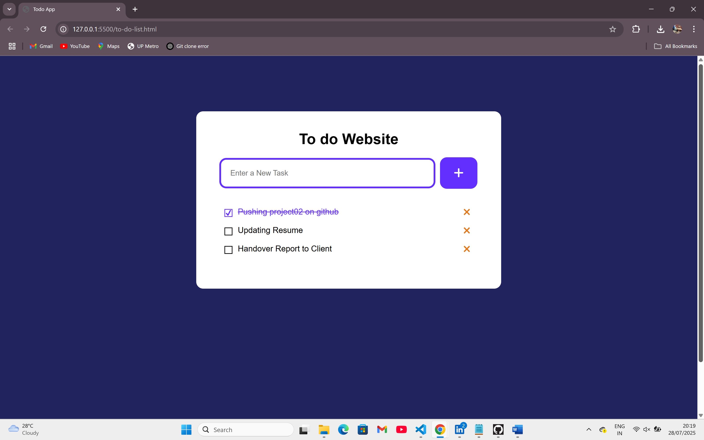

# 📝 Listify – Simple & Interactive To‑Do List
Listify is a minimal yet interactive to‑do list web app that helps you organize and manage your daily tasks efficiently. Built as part of a learning project, it focuses on simplicity, clean UI, and smooth interactions for a better task‑tracking experience.

--------------

# 🌟 Abstract
In today’s fast‑paced life, keeping track of tasks is essential. Listify brings a clean, distraction‑free task manager to your browser. Whether it’s for work, study, or personal chores, you can add, mark as done, and delete tasks effortlessly — all with a responsive and intuitive interface.

-------------

# 🚀 Key Features

✅ **Add Tasks** – Quickly add your daily to‑dos
✏️ **Edit/Delete Tasks** – Keep your list up‑to‑date
✔️ **Mark as Complete** – Stay motivated by tracking completed tasks
📱 **Responsive Design** – Works seamlessly on mobile & desktop
🎯 **Interactive UI** – Smooth animations & clean styling

-----

## 🛠️ Tech Stack

| Layer         | Tech Stack                        |
|---------------|------------------------------------|
|💻 Frontend    | HTML, CSS, JavaScript             |
| 🎨 Styling	   | Custom CSS                        |
|⚡ Interaction     |Vanilla JavaScript                |

---

## 📸 Screenshots
  

## ⭐️ Give it a Star!

If you find IntelliMail helpful, please ⭐️ the repo on GitHub! Your support encourages future improvements and new features.

